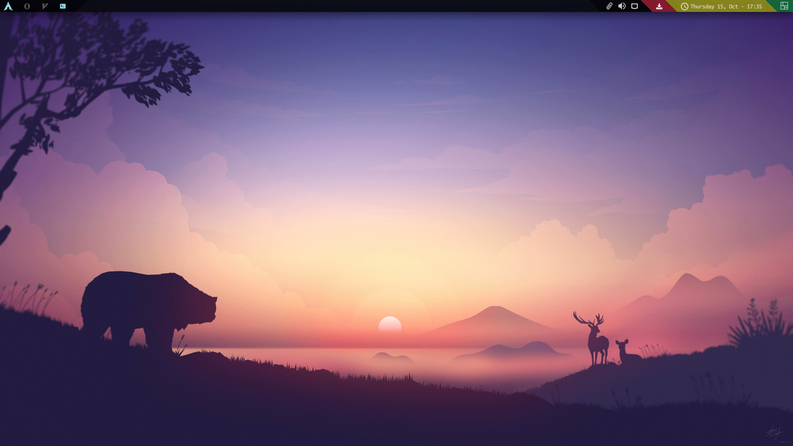
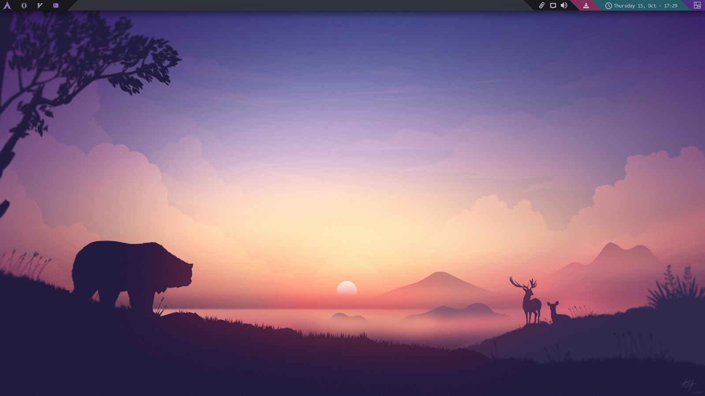

Material Warm Theme

Qogir Theme



A theme consists of a file named **colors.json** and a folder named

```json
{
    "dark": [
        "#030305"
    ],
    "background": [
        "#090b12"
    ],
    "grey": [
        "#5c5c5c"
    ],
    "font": [
        "#ffffff"
    ],
    "primary": [
        "#146e3b"
    ],
    "secondary": [
        "#918f19"
    ],
    "third": [
        "#8f1a2c"
    ],
    "primary-lighter": [
        "#4aeaff"
    ]
}
```

The **img** folder must have this content:

```
- groups.png
- systray.png
- primary.png
- seconday.png
- seconday-monitor.png
- third.png
```
