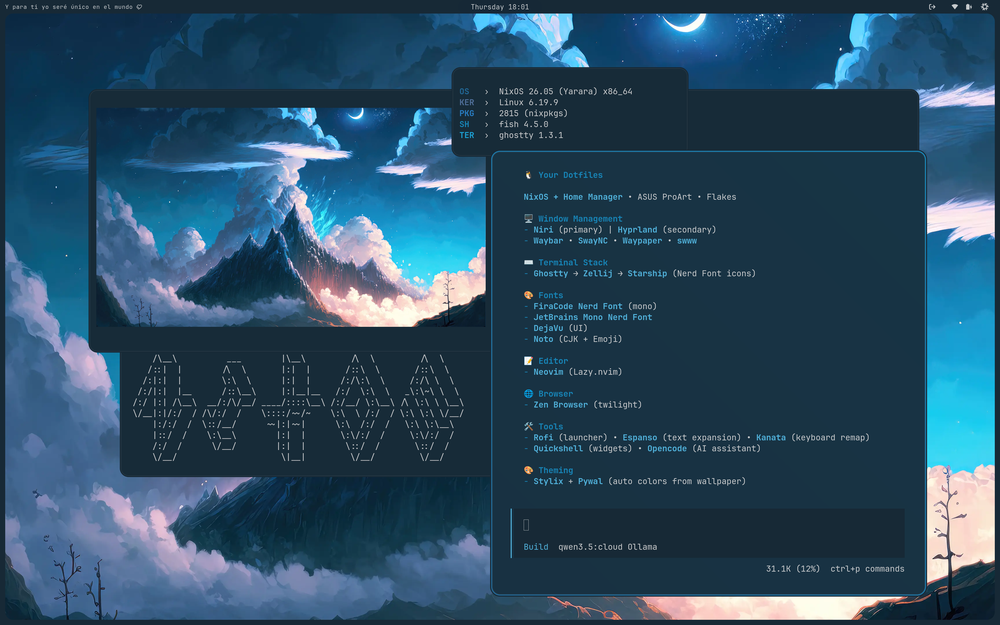

# Dotfiles

NixOS + Home Manager configuration for [ASUS ProArt](nixconf/hosts/asus-proart/).



## What's Included

### Desktop / Window Management
- **Niri** - Wayland compositor (primary)
- **Hyprland** - Wayland compositor (secondary)
- **Waybar** - Status bar
- **SwayNC** - Notifications
- **Waypaper** - Wallpaper manager

### Terminal & Shells
- **Ghostty** - Terminal emulator
- **Zellij** - Terminal multiplexer
- **Starship** - Prompt

### Applications
- **Neovim** - Editor
- **Rofi** - App launcher
- **Quickshell** - Desktop widgets
- **Espanso** - Text expansion

### Input
- **Kanata** - Keyboard layout remapping

### Visual
- **Fastfetch** - System info display
- **Wal** - Color schemes (pywal)

### AI Coding
- **Opencode** - AI coding assistant (with pywal theme)

## Apply Config

```bash
cd nixconf
sudo nixos-rebuild switch --flake .#asus-proart
home-manager switch --flake .#asus-proart
```

After rebuilding, your dotfiles will be symlinked to `$HOME/dotfiles/` and configs linked to their expected locations.

## Structure

```
nixconf/
├── flake.nix           # Flake definition
├── hosts/              # Machine-specific configs
│   └── asus-proart/    # This machine
├── home-manager/       # User-level configs
│   ├── home.nix        # Symlinks to dotfiles/
│   └── features/       # Feature modules
├── nixos/              # NixOS module definitions
│   └── features/       # System features
└── assets/             # Static assets
```
