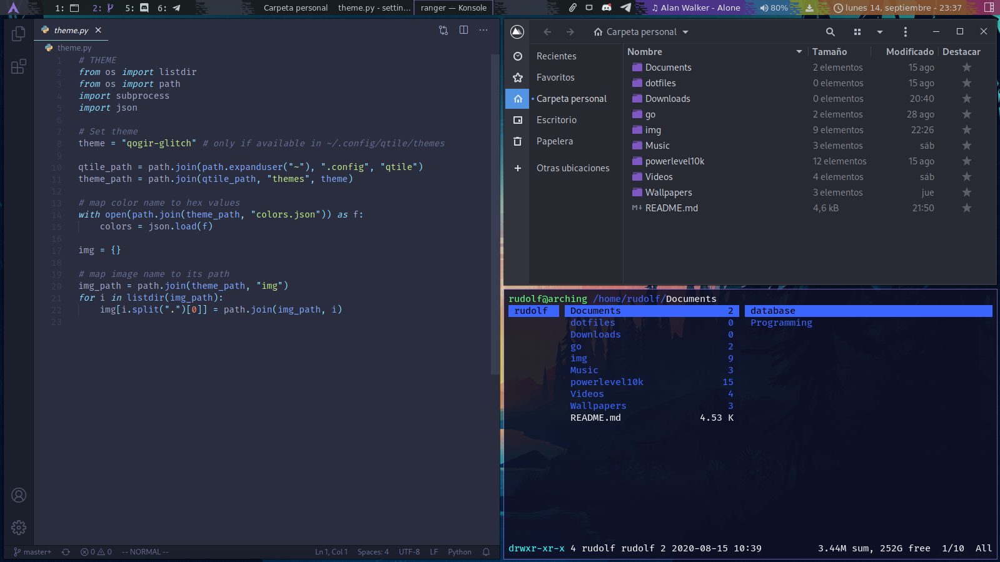

# Dotfiles & Configs



Dotfiles include the background, you can replace it with the same name (background[.jpg or .png]) or editing/adding something like this:
```bash
# ~/.xsession

feh --bg-scale your-wallpaper.jpg
```
<br/>
The repository include more backgrounds images in the Wallpaper folder.

# Tutorial

You will need git to run this:

```bash
git clone https://github.com/ghaerdi/dotfiles
cp -R home/usuario/dotfiles/. home/usuario/
```

<table><tr>

<td valign="top" width="33%">

### Basic packages

- Sudo (permits for users)
- networkmanager (internet and wifi)
- intel-ucode o amd-ucode
- Grub (bootloader)
- Xorg (graphics)
- Git
- base-devel (AUR)
- Lightdm (login screen)
- pulseaudio (sound)

</td><td valign="top" width="34%">

### Packages for Qtile

- Qtile (tilling window manager)
- Konsole (terminal)
- Opera (browser)
- Ranger (terminal file explorer)
- Rofi (menu and search apps)
- Brightnessctl
- Redshift (color temperature)
- pulseaudio-alsa (sound)
- alsa-utils (terminal volume control)
- moc (terminal music player)
- deepin-screenshot (screenshot)
- xfce4-clipman (clipboard systray)
- FiraCode & UbuntuMono Nerd Fonts (font and symbols)

</td><td valign="top" width="33%">

### Optional packages

- ntfs-3g (partitions)
- polkit (partitions)
- os-prober (show windows OS in grub)
- Htop (task manager)
- Neofetch (logo + info system in terminal)
- Picom (transparency)
- Feh (background)
- yarn & npm
- Nautilos o thunar (file explorer GUI)
- network-manager-applet (NetworkManager systray)
- pavucontrol (volume control GUI)
- libnotify & notification-daemon (notifications)
- udiskie (automount)
- cbatticon (batery systray)
- volumeicon (volume systray)
- neovim (terminal file editor)

</td></tr></table>
